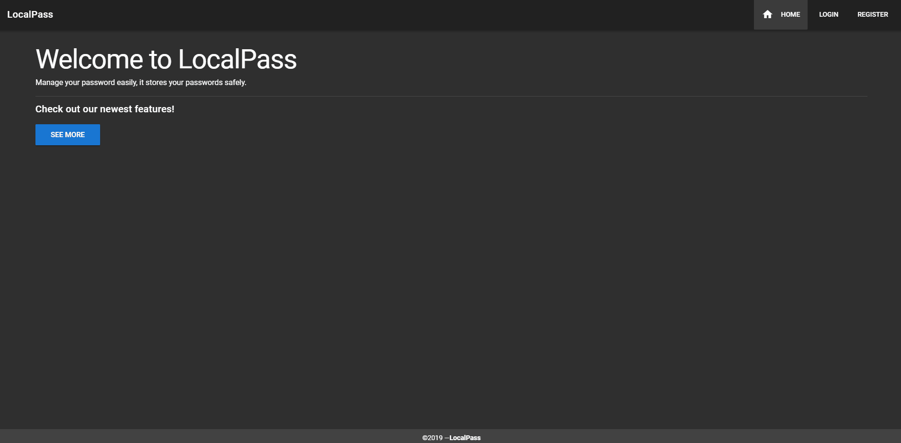

# Localpass Frontend

### Description
**Localpass** is a web application that you can manage your credentials in a secure solution. 
Every fields of password is encrypted.
The project consist of two side. The [backend](https://github.com/oktaykcr/localpass-be) side is written with Java Spring Boot, frontend side is written with vueJs.

> Technologies & Frameworks
* Frontend
    * Vue: 2.6.6
        * *vue-resource*
        * *vue-router*
        * *vuetify*
        * *vuex*

### Installation

> Docker

1.  Execute `docker build -t localpass-frontend .` command at root directory to build localpass-front image for docker container.
2. To deploy our image to container execute `docker run -it -p 8080:8080 localpass-frontend`.
3. You should be able to start or stop your localpass-fronted container with `docker container start|stop localpass-frontend`

> Local

1. Install dependencies with `npm install`
2. Run frontend server `npm run serve` on port **8080**

 

